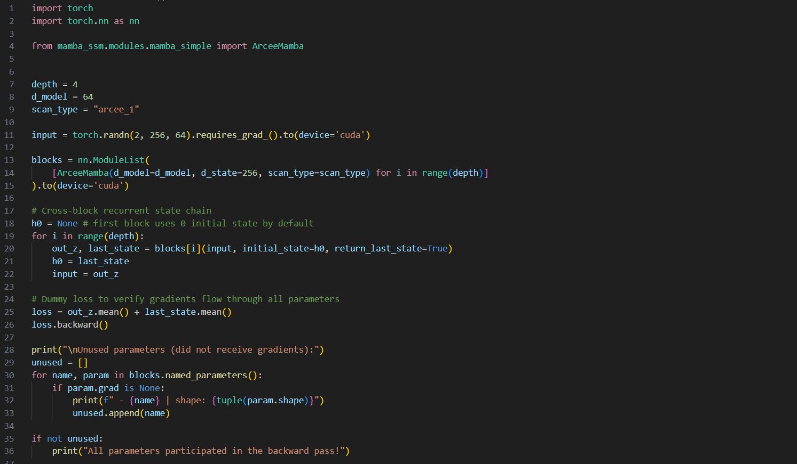

# Arcee Selective Scan Mamba Layer


> **Arcee Selective Scan Mamba Layer: **\
> Jitesh Chavan, Anand Kamat*, Rohit Lal*, Mengjia Xu\
> Paper: https://arxiv.org/abs/2511.11243


## Overview
This repo is an **atomic, layer-only implementation** of the Arcee-style **extended selective scan** with a **cross-block recurrent state chain**, introduced in [Arcee: Differentiable Recurrent State Chain for Generative Vision Modeling with Mamba SSMs](https://arxiv.org/abs/2511.11243) paper.

- Focused on the **core Mamba SSM layer + extended selective scan interface**  
- Drop-in block for your own training
- For the complete codebase including training scaffolding repository please visit [Official Arcee repository](https://github.com/JiteshChavan/Arcee)

## Installation

```bash
# 1) Create and activate env (Python 3.10.8)
conda create -n arcee-mamba python=3.10.8
conda activate arcee-mamba

# 2) Install CUDA 12.8 toolkit inside the env
conda install nvidia/label/cuda-12.8.0::cuda-toolkit

# 3) Install Python requirements
pip install -r req.txt

# 4) Install PyTorch 2.8 with CUDA 12.8 wheels (make sure cuda-toolkit and torch version match)
pip3 install torch torchvision

# 5) Build local extensions
cd causal_conv1d
pip install -e . --no-build-isolation -vvv

cd ../ArceeMamba
pip install -e . --no-build-isolation -vvv

# 6) From repo root, verify install
cd ..
bash run_test.sh   # if this runs, setup is successful

```

## Usage

